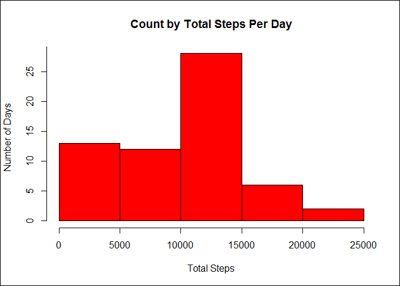
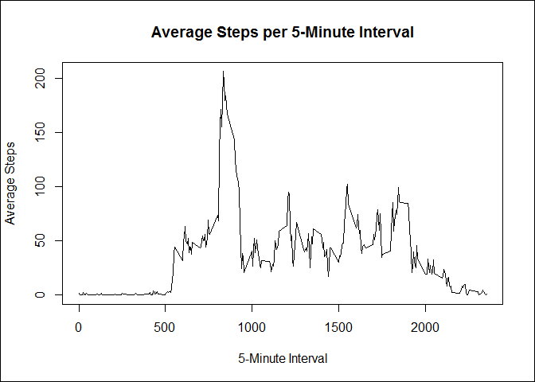
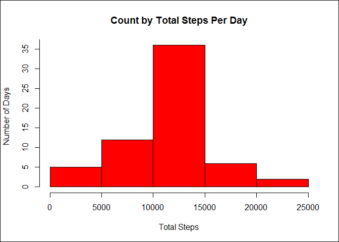

# Reproducible Research: Peer Assessment 1
Scott Harrison  
September 14, 2014  

Reproducible Research: Peer Assessment 1  
========================================
*Created by Scott Harrison on September 14, 2014*  

## Loading and preprocessing the data

```r
library(reshape2)
data <- read.csv("activity.csv", header = TRUE, na.strings = "NA")
data$date <- as.Date(data$date, "%Y-%m-%d")
datesummary <- dcast(data, date~interval, value.var = "steps")
datesummary <- cbind(datesummary, rowSums(datesummary[2:ncol(datesummary)], na.rm = TRUE))
colnames(datesummary) <- c(colnames(datesummary[1:ncol(datesummary) - 1]), "total")
```

## What is mean total number of steps taken per day?

```r
hist(datesummary[, "total"], 
     main = "Count by Total Steps Per Day", 
     xlab = "Total Steps", 
     ylab = "Number of Days", 
     col = "red",
     yaxp = c(0, 30, 6))
box(which = "outer", col = "black")
```

 

```r
totalsteps_mean <- format(mean(datesummary[, "total"]), nsmall = 1)
totalsteps_median <- format(median(datesummary[, "total"]), nsmall = 1)
```

The mean total steps per day is 9354.2 and the median total steps per day is 
10395.0.  Above is a histogram of the total steps per day.  

## What is the average daily activity pattern?

```r
averagesteps <- colMeans(datesummary[2:289], na.rm = TRUE)
plot(names(averagesteps), 
     averagesteps, 
     type = "l",
     main = "Average Steps per 5-Minute Interval",
     xlab = "5-Minute Interval",
     ylab = "Average Steps")
box(which = "outer", col = "black")
```

 

```r
maxavg <- max(averagesteps)
maxavgcolidx <- which(match(averagesteps, maxavg) == 1)
maxavginterval <- names(averagesteps[maxavgcolidx])
```

The max average steps for a 5-minute interval is 206.1698 for the 835 interval.  

## Imputing missing values

```r
missingnum <- sum(is.na(data$steps))

datesummaryimp <- datesummary[1:ncol(datesummary) - 1]
for (row in 1:nrow(datesummaryimp)) {
    for (col in 2:ncol(datesummaryimp)) {
        if (is.na(datesummaryimp[row, col])) {
            datesummaryimp[row, col] <- averagesteps[col - 1]
        }
    }   
}
datesummaryimp <- cbind(datesummaryimp, rowSums(datesummaryimp[2:ncol(datesummaryimp)], na.rm = TRUE))
colnames(datesummaryimp) <- c(colnames(datesummaryimp[1:289]), "total")

hist(datesummaryimp[, "total"], 
     main = "Count by Total Steps Per Day", 
     xlab = "Total Steps", 
     ylab = "Number of Days", 
     col = "red",
     yaxp = c(0, 40, 8))
box(which = "outer", col = "black")
```

 

```r
totalstepsimp_mean <- format(mean(datesummaryimp[, "total"]), nsmall = 1)
totalstepsimp_median <- format(median(datesummaryimp[, "total"]), nsmall = 1)
```

There were a total of 2304 missing values.  I imputed by replacing NAs with the average value for that 5-minute interval for all days.  The mean total steps per day after imputation is 10766.2 and the median total steps per day after imputation is 10766.2.  Above is a histogram of the total steps per day after imputation.  After imputation, the mean value is more prominant.

## Are there differences in activity patterns between weekdays and weekends?

```r
library(lattice)
datamelt <- melt(datesummaryimp[1:(ncol(datesummary) - 1)], id = "date")

weekend <- function(date) {
    dayofweek <- weekdays(date)
    if (dayofweek == "Saturday" | dayofweek == "Sunday") {
        return ("weekend")
    }
    else {
        return ("weekday")
    }
}

weekpart <- sapply(datamelt$date, weekend)

columns <- c("weekpart", "interval", "value")
datamelt <- cbind(weekpart, datamelt[2:3])
colnames(datamelt) <- columns

databyinterval <- aggregate(value ~ weekpart + interval, data = datamelt, mean)

databyinterval$interval <- as.numeric(levels(databyinterval$interval))[databyinterval$interval]

xyplot(value ~ interval | weekpart, 
       databyinterval, 
       layout = c(1, 2),
       type = "l",
       ylab = "Number of Steps",
       xlab = "Interval")
```

 
