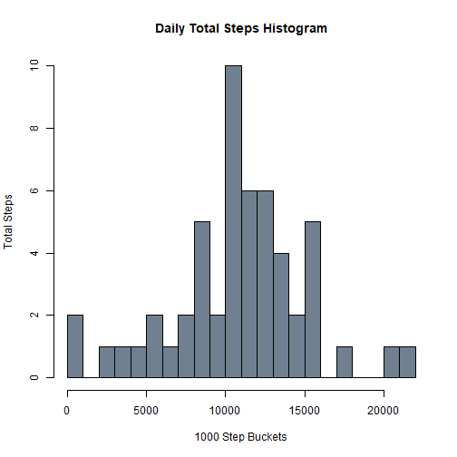
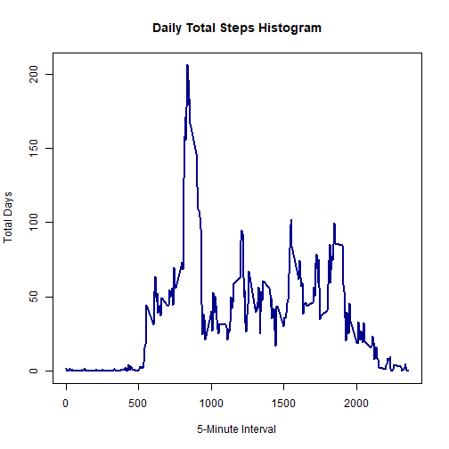
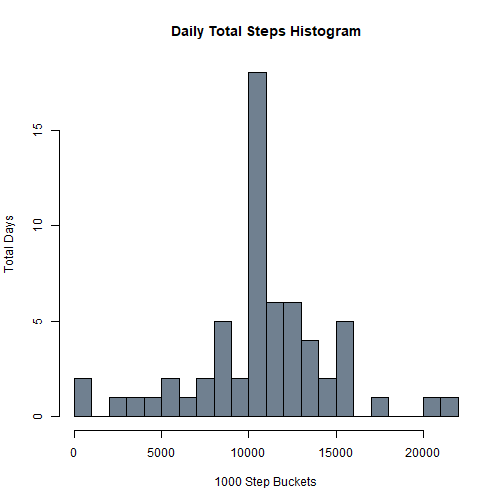
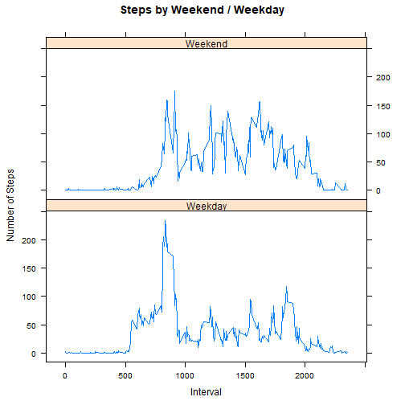

## Loading and preprocessing the data

Unzips data, loads csv and converts date column from factor to date.  


```r
data_zip <- "activity.zip"
unzip(data_zip)

data_csv <- "activity.csv"
data <- read.csv(data_csv)
data$date <- as.Date(data$date)
```

## What is mean total number of steps taken per day?


```r
daily <- aggregate(data$steps, by = list(data$date), FUN = sum)
names(daily) <- c("Date", "TotalSteps")
daily <- daily[!is.na(daily$TotalSteps), ]

bucket_width <- 1000
buckets <- seq(from = 0,
               by = bucket_width,
               length.out = trunc(max(daily$TotalSteps) / bucket_width) + 2)
hist(daily$TotalSteps,
     breaks = buckets,
     col = "SlateGrey",
     main = "Daily Total Steps Histogram",
     xlab = "1000 Step Buckets",
     ylab = "Total Steps")
```



The mean of total daily steps is:

```r
mean(daily$TotalSteps)
```

```
## [1] 10766.19
```
The median total daily steps is:

```r
median(daily$TotalSteps)
```

```
## [1] 10765
```

## What is the average daily activity pattern?


```r
intervals <- aggregate(data$steps, by = list(data$interval), FUN = mean, na.rm = TRUE)
names(intervals) <- c("Interval", "TotalSteps")
intervals <- intervals[!is.na(intervals$TotalSteps), ]

plot(TotalSteps ~ Interval,
     data = intervals,
     type = "l",
     main = "Daily Total Steps Histogram",
     xlab = "5-Minute Interval",
     ylab = "Total Days",
     col = "DarkBlue",
     lwd = 2)
```



The 5-minute interval with the most steps is interval:

```r
intervals$Interval[which(intervals$TotalSteps == max(intervals$TotalSteps))]
```

```
## [1] 835
```

## Imputing missing values

The number of missing values is:

```r
sum(is.na(data$steps))
```

```
## [1] 2304
```

To impute values, I substitued the average value for the 5-minute interval for the NA.

```r
data_imputed <- merge(data, 
                      intervals, 
                      by.x = "interval", 
                      by.y = "Interval")
data_imputed$steps_imputed <- with(data_imputed,
                                   ifelse(is.na(steps), TotalSteps, steps))

daily_imputed <- aggregate(data_imputed$steps_imputed,
                           by = list(data_imputed$date),
                           FUN = sum)
names(daily_imputed) <- c("Date", "TotalSteps")
```


```r
bucket_width <- 1000
buckets <- seq(from = 0,
               by = bucket_width,
               length.out = trunc(max(daily_imputed$TotalSteps) / bucket_width) + 2)
hist(daily_imputed$TotalSteps,
     breaks = buckets,
     col = "SlateGrey",
     main = "Daily Total Steps Histogram",
     xlab = "1000 Step Buckets",
     ylab = "Total Days")
```



The mean of total daily steps with imputed values is:

```r
mean(daily_imputed$TotalSteps)
```

```
## [1] 10766.19
```
The median total daily steps with imputed values is:

```r
median(daily_imputed$TotalSteps)
```

```
## [1] 10766.19
```

The effect of imputing values only added more average days because NAs are only on specific days.


```r
dailyNA <- aggregate(is.na(data$steps), by = list(data$date), sum)
names(dailyNA) <- c("Date", "NAs")
dailyNA[dailyNA$NAs > 0, ]
```

```
##          Date NAs
## 1  2012-10-01 288
## 8  2012-10-08 288
## 32 2012-11-01 288
## 35 2012-11-04 288
## 40 2012-11-09 288
## 41 2012-11-10 288
## 45 2012-11-14 288
## 61 2012-11-30 288
```
Imputing average daily values for entire days does not really help and the mean stays the same.  The median now is the mean because more mean values were added.

## Are there differences in activity patterns between weekdays and weekends?

The most noticeable difference between weekdays and weekends is that there is a large mount of steps on weekday mornings that are not in the weekends.  This is probably due to work related movement.  It also looks like weekdays are a bit more sedantary.


```r
library(lattice)

data_imputed$weekend <- factor(weekdays(data_imputed$date) %in% c("Saturday", "Sunday"), 
                               labels = c("Weekday", "Weekend"))
intervals <- aggregate(steps ~ interval + weekend, 
                       data = data_imputed, 
                       FUN = mean)
names(intervals) <- c("Interval", "Weekend", "TotalSteps")

xyplot(TotalSteps ~ Interval | Weekend, 
       data = intervals,
       type = "l",
       layout = c(1, 2),
       main = "Steps by Weekend / Weekday",
       ylab = "Number of Steps")
```




